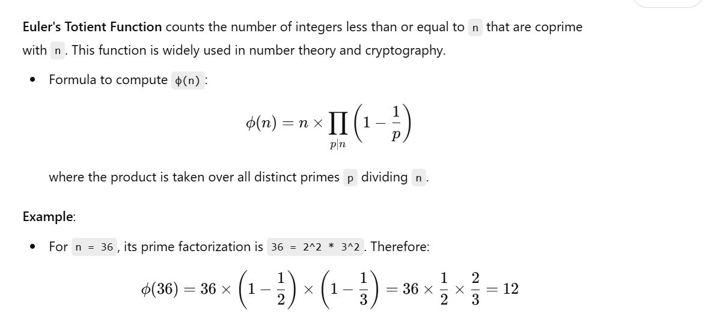

Here are some **commonly used mathematical formulas** in **computer algorithms**. These formulas span several fields like number theory, combinatorics, graph theory, and geometry, and they are useful in many algorithms, especially when optimizing performance or solving problems.

### 1. **Big O Notation (Time and Space Complexity)**
   - **Big O** describes the upper bound of an algorithm's time or space complexity in the worst case.
   
   - **Big-O Notation** for various operations:
     - Constant: `O(1)`
     - Logarithmic: `O(log n)`
     - Linear: `O(n)`
     - Linearithmic: `O(n log n)`
     - Quadratic: `O(n^2)`
     - Cubic: `O(n^3)`
     - Exponential: `O(2^n)`
     - Factorial: `O(n!)`
   
   This helps to analyze the performance of algorithms.

### 2. **Sieve of Eratosthenes (Prime Number Algorithm)**

   The **Sieve of Eratosthenes** is an efficient algorithm to find all prime numbers up to a given limit `n`.

   - Time Complexity: `O(n log log n)`

   - Steps:
     1. Create a boolean array `is_prime[]` of size `n+1` and initialize all entries as `true`.
     2. Start from the first prime number (2) and mark all its multiples as `false`.
     3. Repeat the process for all numbers up to `sqrt(n)`.

   - Formula:
     ```cpp
     for (p = 2; p * p <= n; p++) {
         if (is_prime[p] == true) {
             for (i = p * p; i <= n; i += p)
                 is_prime[i] = false;
         }
     }
     ```

### 3. **Euclidean Algorithm (Greatest Common Divisor)**

   The **Euclidean algorithm** finds the greatest common divisor (GCD) of two integers `a` and `b`.

   - Formula:
     ```cpp
     while (b != 0) {
         int temp = b;
         b = a % b;
         a = temp;
     }
     return a;
     ```
   - Time Complexity: `O(log(min(a, b)))`

### 4. **Extended Euclidean Algorithm**

   It finds the GCD of `a` and `b`, and also returns the coefficients of Bézout's identity (`x`, `y`) such that:
   \[
   ax + by = \text{gcd}(a, b)
   \]
   
   - Formula:
     ```cpp
     int extendedGCD(int a, int b, int &x, int &y) {
         if (b == 0) {
             x = 1;
             y = 0;
             return a;
         }
         int x1, y1;
         int gcd = extendedGCD(b, a % b, x1, y1);
         x = y1;
         y = x1 - (a / b) * y1;
         return gcd;
     }
     ```

   - Time Complexity: `O(log(min(a, b)))`

### 5. **Binomial Coefficient (Combinatorics)**

   The **binomial coefficient** `C(n, k)` calculates the number of ways to choose `k` items from `n` items.

   - Formula:
     \[
     C(n, k) = \frac{n!}{k!(n - k)!}
     \]
   
   - Recursive Formula:
     \[
     C(n, k) = C(n - 1, k - 1) + C(n - 1, k)
     \]
     
   - Time Complexity of computing binomial coefficient directly using recursion is exponential, but can be optimized using dynamic programming or memoization.

### 6. **Fibonacci Sequence**

   The **Fibonacci sequence** is defined as:
   \[
   F(0) = 0, \quad F(1) = 1, \quad F(n) = F(n-1) + F(n-2) \quad \text{for} \ n \geq 2
   \]
   
   **Matrix Exponentiation** can be used to compute Fibonacci numbers in `O(log n)` time.

   - Formula:
     ```cpp
     int fibonacci(int n) {
         if (n == 0) return 0;
         if (n == 1) return 1;
         return fibonacci(n - 1) + fibonacci(n - 2);
     }
     ```

   - Optimized using dynamic programming (memoization) or matrix exponentiation to `O(log n)` time.

### 7. **Binary Search**

   **Binary search** is an efficient algorithm for finding an element in a **sorted array**.

   - Formula:
     ```cpp
     int binarySearch(int arr[], int low, int high, int x) {
         while (low <= high) {
             int mid = low + (high - low) / 2;
             if (arr[mid] == x)
                 return mid;
             else if (arr[mid] < x)
                 low = mid + 1;
             else
                 high = mid - 1;
         }
         return -1;
     }
     ```

   - Time Complexity: `O(log n)`

### 8. **Dijkstra's Algorithm (Shortest Path)**

   **Dijkstra's algorithm** is used to find the shortest paths from a source vertex to all other vertices in a **weighted graph**.

   - Time Complexity:
     - Using **priority queues** (binary heap): `O((V + E) log V)`
     - Without priority queues: `O(V^2)`

   - Formula:
     ```cpp
     while (minHeap is not empty) {
         vertex u = extractMin(minHeap);
         for each neighbor v of u {
             if (distance[v] > distance[u] + weight(u, v)) {
                 distance[v] = distance[u] + weight(u, v);
                 minHeap.insert(v, distance[v]);
             }
         }
     }
     ```

### 9. **Matrix Multiplication (Strassen's Algorithm)**

   **Matrix multiplication** is a key operation in many algorithms (e.g., dynamic programming, graph algorithms, etc.).

   - **Naive Matrix Multiplication**: `O(n^3)`
   
   - **Strassen's Algorithm** (Optimized Matrix Multiplication): `O(n^log2(7)) ≈ O(n^2.81)`

### 10. **Fast Exponentiation (Exponentiation by Squaring)**

   This algorithm is used to calculate powers efficiently.

   - Formula:
     \[
     x^n =
     \begin{cases}
     (x^{n/2})^2 & \text{if } n \text{ is even} \\
     x \cdot x^{n-1} & \text{if } n \text{ is odd}
     \end{cases}
     \]
   
   - Time Complexity: `O(log n)`

### 11. **Modular Arithmetic**

   **Modular Arithmetic** is used in many number-theoretic algorithms, such as when working with large numbers.

   - **Modular Exponentiation**:
     \[
     \text{pow}(a, b, m) \text{ (Computes } a^b \mod m\text{)}
     \]
   
   - **Modular Inverse**: If `a` and `m` are coprime, then the modular inverse `a^-1 mod m` can be found using the Extended Euclidean Algorithm.

   - **Formula for Modular Exponentiation**:
     ```cpp
     long long modExp(long long a, long long b, long long m) {
         long long result = 1;
         a = a % m;
         while (b > 0) {
             if (b % 2 == 1)
                 result = (result * a) % m;
             b = b / 2;
             a = (a * a) % m;
         }
         return result;
     }
     ```

### 12. **Pigeonhole Principle**

   The **Pigeonhole Principle** is used in many problems in combinatorics, where you are trying to find something in a set with limited options.

   - **Basic Form**: If `n` items are distributed into `m` boxes, and if `n > m`, then at least one box must contain more than one item.
   
   Example in algorithm design:
   - Finding duplicates in an array.

---

These formulas and concepts are foundational in many algorithms and problem-solving techniques. Understanding them will help you improve your skills in competitive programming, algorithm design, and analysis.


Certainly! Here are more **mathematical formulas and concepts** commonly used in **computer algorithms**, including some that are based on **Euler’s theories**:

### 25. **Euler's Theorem**

   **Euler’s Theorem** is an important result in number theory, specifically in modular arithmetic. It generalizes Fermat's Little Theorem and provides an efficient way to compute powers in modular arithmetic.

   - **Euler’s Theorem**:
     If `a` and `n` are coprime, then:
     \[
     a^{\phi(n)} \equiv 1 \ (\text{mod} \ n)
     \]
     where `φ(n)` is Euler’s Totient Function.
   
   **Applications**:
   - Cryptographic algorithms like RSA rely heavily on Euler’s Theorem for public key encryption.

---

### 26. **Euler's Totient Function (φ(n))**

   **Euler's Totient Function** counts the number of integers less than or equal to `n` that are coprime with `n`. This function is widely used in number theory and cryptography.

   - Formula to compute `φ(n)`:
     \[
     \phi(n) = n \times \prod_{p \mid n} \left(1 - \frac{1}{p}\right)
     \]
     where the product is taken over all distinct primes `p` dividing `n`.
   
   **Example**:
   - For `n = 36`, its prime factorization is `36 = 2^2 * 3^2`. Therefore:
     \[
     \phi(36) = 36 \times \left(1 - \frac{1}{2}\right) \times \left(1 - \frac{1}{3}\right) = 36 \times \frac{1}{2} \times \frac{2}{3} = 12
     \]
   
   **Applications**:
   - Used in RSA algorithm to compute keys and in cryptography for key generation.

---

### 27. **Modular Inverse (Extended Euclidean Algorithm)**

   The **modular inverse** is crucial for solving linear congruences, and it is widely used in cryptography.

   - If `a` and `n` are coprime, then there exists an integer `x` such that:
     \[
     a \times x \equiv 1 \ (\text{mod} \ n)
     \]
     This `x` is called the modular inverse of `a` modulo `n`.
   
   - **Extended Euclidean Algorithm** can be used to compute the modular inverse.
   
   **Algorithm**: Find `x` such that:
   \[
   a \times x \equiv 1 \ (\text{mod} \ n)
   \]
   
   **Time Complexity**: `O(log n)` using the Extended Euclidean Algorithm.

---

### 28. **Sieve of Eratosthenes**

   The **Sieve of Eratosthenes** is an efficient algorithm to find all prime numbers up to a given number `n`. It works by iteratively marking the multiples of each prime number starting from 2.

   - **Algorithm**: For each number `i` starting from 2, mark all multiples of `i` as non-prime.
   
   - **Time Complexity**: `O(n log log n)`
   
   **Applications**:
   - Finding primes up to a large number.
   - Used in primality testing and factoring algorithms.

   ```cpp
   vector<bool> sieve(int n) {
       vector<bool> primes(n + 1, true);
       primes[0] = primes[1] = false;
       for (int i = 2; i * i <= n; ++i) {
           if (primes[i]) {
               for (int j = i * i; j <= n; j += i) {
                   primes[j] = false;
               }
           }
       }
       return primes;
   }
   ```

---

### 29. **Fast Exponentiation (Exponentiation by Squaring)**

   **Fast Exponentiation** or **Exponentiation by Squaring** is a technique for computing large powers of numbers efficiently, especially useful in modular arithmetic.

   - **Formula**:
     \[
     a^b = \begin{cases} 
     (a^{b/2})^2 & \text{if } b \text{ is even} \\
     a \times a^{b-1} & \text{if } b \text{ is odd}
     \end{cases}
     \]
   
   - **Time Complexity**: `O(log b)` for calculating `a^b`.
   
   **Applications**:
   - Used in modular exponentiation, cryptography (RSA, Diffie-Hellman).
   - Computation of Fibonacci numbers, and other recursive sequences.

---

### 30. **Chinese Remainder Theorem (CRT)**

   **Chinese Remainder Theorem (CRT)** is used to solve systems of simultaneous linear congruences with pairwise coprime moduli. It's widely used in number theory, cryptography, and algorithms dealing with modular arithmetic.

   - **Theorem**: Given a system of congruences:
     \[
     x \equiv a_1 \ (\text{mod} \ m_1)
     \]
     \[
     x \equiv a_2 \ (\text{mod} \ m_2)
     \]
     \[
     \vdots
     \]
     \[
     x \equiv a_k \ (\text{mod} \ m_k)
     \]
     - If `m_1, m_2, ..., m_k` are pairwise coprime, then there exists a unique solution modulo the product of the moduli.
   
   - **Algorithm**: Can be solved using the extended Euclidean algorithm.

   **Applications**:
   - Cryptography (RSA algorithm, Shamir’s Secret Sharing).
   - Distributed computing for handling multiple modular operations.

---

### 31. **Bézout’s Identity**

   **Bézout’s Identity** provides a way to express the greatest common divisor (GCD) of two numbers as a linear combination of those two numbers.

   - **Formula**:
     \[
     \text{gcd}(a, b) = ax + by
     \]
     for some integers `x` and `y`. This is useful in algorithms like the Extended Euclidean Algorithm.

   **Applications**:
   - Used in finding modular inverses (as part of the Extended Euclidean Algorithm).
   - Cryptography (RSA, Diffie-Hellman key exchange).

---

### 32. **Binomial Coefficient (n choose k)**

   The **Binomial Coefficient** is used in combinatorics to determine the number of ways to choose `k` elements from a set of `n` elements. This is useful in probability, dynamic programming, and combinatorial optimization problems.

   - Formula:
     \[
     C(n, k) = \frac{n!}{k!(n - k)!}
     \]
   
   - **Time Complexity**: `O(k)` for computing `C(n, k)` using an iterative approach.

   **Applications**:
   - Combinatorics, probability theory.
   - Dynamic programming (e.g., Pascal’s Triangle).

---

### 33. **Fibonacci Sequence and Golden Ratio**

   The **Fibonacci Sequence** is a sequence of numbers where each number is the sum of the two preceding ones. The sequence starts with `0` and `1`, and the nth Fibonacci number is given by:

   \[
   F(n) = F(n-1) + F(n-2)
   \]

   - Formula for the nth Fibonacci number using **Binet’s Formula**:
     \[
     F(n) = \frac{\phi^n - (1 - \phi)^n}{\sqrt{5}}
     \]
     where `φ` is the golden ratio \( \phi = \frac{1 + \sqrt{5}}{2} \).
   
   **Time Complexity**:
   - Recursion: `O(2^n)`
   - Dynamic programming: `O(n)`
   - Matrix exponentiation: `O(log n)` for the nth Fibonacci number.

---

### 34. **Logarithmic Identities**

   Logarithms are used frequently in algorithm analysis, especially when dealing with time complexity and divide-and-conquer problems. Some key logarithmic identities include:

   - **Change of Base Formula**:
     \[
     \log_b(a) = \frac{\log_k(a)}{\log_k(b)}
     \]
   - **Product Rule**:
     \[
     \log_b(xy) = \log_b(x) + \log_b(y)
     \]
   - **Quotient Rule**:
     \[
     \log_b\left(\frac{x}{y}\right) = \log_b(x) - \log_b(y)
     \]
   - **Power Rule**:
     \[
     \log_b(x^y) = y \log_b(x)
     \]
   - **Logarithmic Growth**:
     \[
     O(\log n)
     \]
     is a common complexity in algorithms like binary search, and divide-and-conquer.

   **Applications**:
   - Used in analyzing time complexity of algorithms (e.g., binary search, merge sort).
   - Algorithms that divide a problem into smaller subproblems, such as in divide and conquer.

---

### 35. **Kruskal's Algorithm (Minimum Spanning Tree)**

   **Kruskal's

 Algorithm** is a greedy algorithm for finding the **minimum spanning tree** (MST) of a graph. It works by sorting all the edges and adding edges to the MST, provided they do not form a cycle.

   - **Time Complexity**: `O(E log E)` or `O(E log V)` depending on sorting.

   **Applications**:
   - Network design (e.g., designing minimum-cost networks).
   - Cluster analysis.

---

These are just a few more important mathematical concepts and algorithms used frequently in computer science and algorithm design. Understanding these will not only help you in problem-solving but also provide deeper insights into the efficiency and theoretical underpinnings of algorithms.


---
