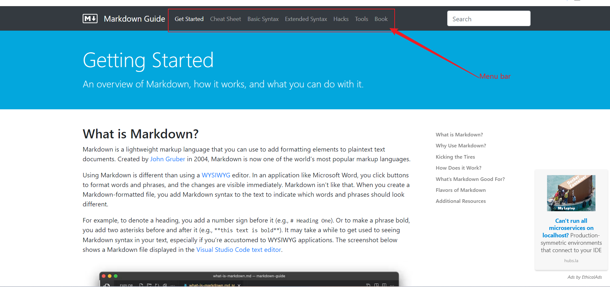

# Examples of different elements in markdown

### 1. indentation of the begining text of one line(non-breaking space)
&nbsp;&nbsp;&nbsp;&nbsp;bestxmg

&nbsp;&nbsp;&nbsp;&nbsp;&nbsp;&nbsp;&nbsp;&nbsp;&nbsp;bestxmg
---
### 2. code block
   - Example:
     ``` cpp
     struct MyStruct {
         int x;
         void print() { std::cout << x << std::endl; }
     };

     class MyClass {
         int x;
         void print() { std::cout << x << std::endl; }
     };
     ```
     key points: the symbol "cpp" after symbol ``` represent the lanuage of the code. If the name of a lanuage is provided, the keyword of the lanuage will be highlighted.
---

### 3. table
   - Example:

     | Syntax      | Description | Test Text     |
     | :---        |    :----:   |          ---: |
     | Header      | Title       | Here's this   |
     | Paragraph   | Text        | And more      |
 ---
### 4. image


---
### 5.
### 6.
### 7.
### 8.
### 9.
### 10.
### 11.
### 12.
### 13.
### 14.
### 15.
### 16.
### 17.
### 18.
### 19.
### 20.
### 21.
### 22.
### 23.
### 24.
### 25.
### 26.
### 27.
### 28.
### 29.
### 30.
### 31.
### 32.
