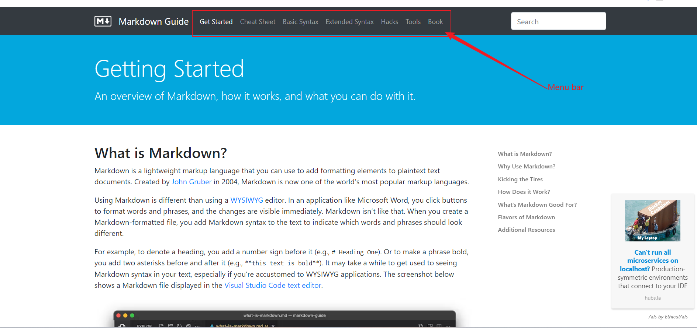

## Knowledge about markdown🐶

### 1. getting start

This guidance will give you a comprehensive guidance including the usage and benefit of markdown. Like this

- [Markdown Guide](https://www.markdownguide.org/)

---
### 2. typical examples of using markdown
There is a list of examples of partial elements of markdown, though they have  been interpreted well in the Markdown Guide. Elements that been included by the list can be more common or complicate than those markdown elements that not in this list. Here is the organized list.

ps: those elements are those to which I am not familiar.

- [example](../subsedinary_markdown/different_markdown_element.md)
- [specific chapter](../subsedinary_markdown/different_markdown_element.md#11)
---
