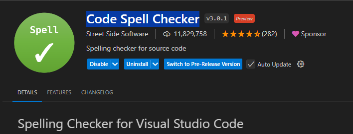
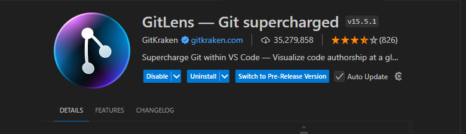
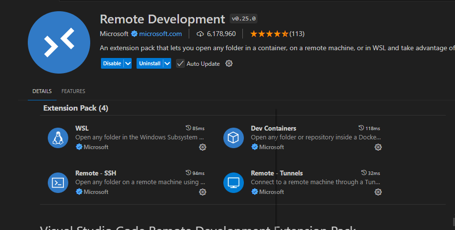

## VSCode skills🐶

### 1 useful extension
- **Code Spell Checker**

   it helps me correct spelling mistake in markdown file

- **GitLens**
   
   It helps to view the history of each line of code. Moreover, it can list the file history.
   
   
- **Remote Development**

   For me, I just use it to connect my centOS virtual machine. I can run terminal and edit files in real time. It seems that this plugin has more practical usages.

   

---
### 2 Setting a language standard in Visual Studio(WIP)
- [guidance](https://www.learncpp.com/cpp-tutorial/configuring-your-compiler-choosing-a-language-standard/)
---

### 3 