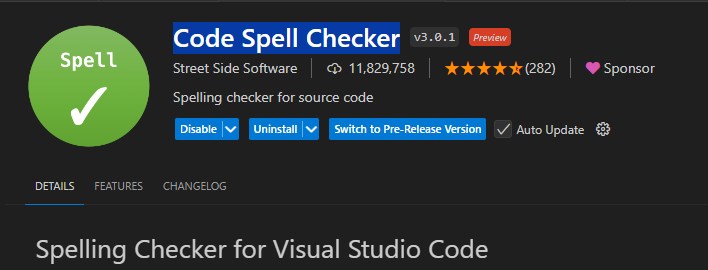
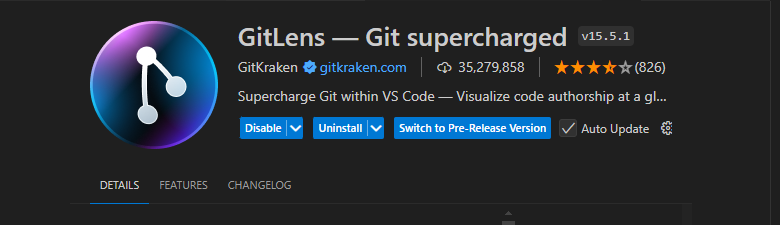
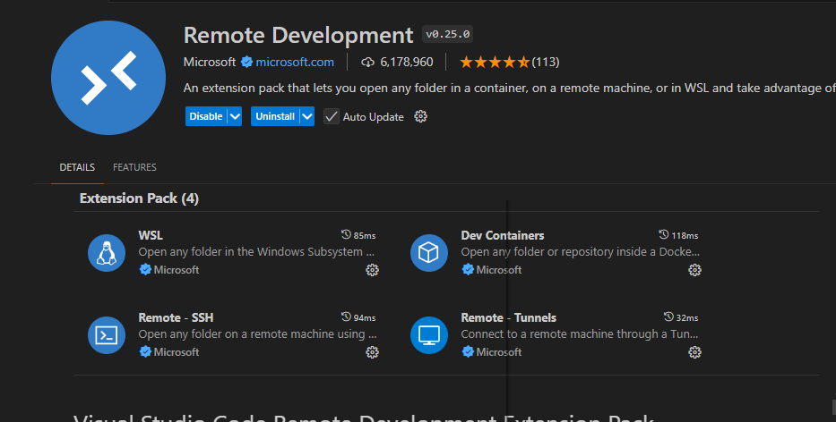
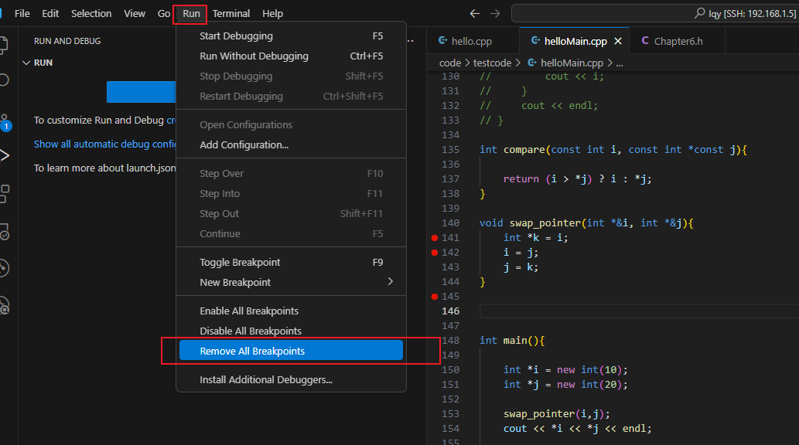

## VSCode skills🐶

### 1 useful extension
- **Code Spell Checker**

   it helps me correct spelling mistake in markdown file


- **GitLens**
   
   It helps to view the history of each line of code. Moreover, it can list the file history.
   
   
- **Remote Development**

   For me, I just use it to connect my centOS virtual machine. I can run terminal and edit files in real time. It seems that this plugin has more practical usages.

   

---
### 2 Setting a language standard in Visual Studio(WIP)
- [guidance](https://www.learncpp.com/cpp-tutorial/configuring-your-compiler-choosing-a-language-standard/)
---

### 3 A copy of task.json
```
{
    "tasks": [
        {
            "type": "cppbuild",
            "label": "C/C++: g++ build active file",
            "command": "/usr/bin/g++",
            "args": [
                "-std=c++11",
                "-fdiagnostics-color=always",
                "-O0",
                "-g",
                "${fileDirname}/*.cpp",// "${file}",
                "-o",
                "${fileDirname}/${fileBasenameNoExtension}",
                "-Werror=vla",
                "-Wall"
            ],
            "options": {
                "cwd": "${fileDirname}"
            },
            "problemMatcher": [
                "$gcc"
            ],
            "group": {
                "kind": "build",
                "isDefault": true
            },
            "detail": "Task generated by Debugger."
        }
    ],
    "version": "2.0.0"
}
```


launch.json
{
    "version": "0.2.0",
    "configurations": [
      {
        "name": "Debug C++ Program",
        "type": "cppdbg",
        "request": "launch",
        "program": "${fileDirname}/${fileBasenameNoExtension}",
        "args": ["/path/to/input.o"],
        "cwd": "${fileDirname}"
      }
    ]
}

WIP
lint
In Visual Studio Code (VSCode), "linting" refers to the process of analyzing code to detect potential errors, bugs, stylistic issues, and code quality problems. Linting tools provide feedback to developers by highlighting issues directly in the editor, helping to improve code quality and maintainability.

### Key Features of Linting in VSCode:

1. **Real-time Feedback**: Linting occurs as you write code, providing instant feedback on potential issues without needing to run the code.

2. **Error Highlighting**: Linting tools highlight errors, warnings, and stylistic issues in your code, making it easier to identify and fix problems.

3. **Code Suggestions**: Many linters offer suggestions for improving code quality or adhering to coding standards, such as naming conventions or formatting guidelines.

4. **Customizable Rules**: Linters often allow you to customize the set of rules they apply, enabling you to enforce specific coding standards that suit your team's preferences or project requirements.

5. **Integration with Version Control**: Linting can be integrated into your version control system (like Git) to enforce coding standards before code is committed or merged.

### Popular Linters in VSCode:

- **ESLint**: Commonly used for JavaScript and TypeScript. It helps identify and report on patterns found in ECMAScript/JavaScript code.
- **Pylint**: A linter for Python that checks for errors, enforces coding standards, and looks for code smells.
- **C/C++ Extension**: Provides linting for C and C++ code, using tools like `cpplint` or `clang-tidy`.

### Setting Up Linting in VSCode:

1. **Install the Appropriate Extension**: Search for and install the relevant linter extension for your programming language in the Extensions view (`Ctrl+Shift+X`).

2. **Configure the Linter**: Many linters require a configuration file (e.g., `.eslintrc`, `.pylintrc`) in your project directory to specify rules and settings.

3. **Enable Linting**: Some extensions may require you to enable linting in the settings. Go to **File > Preferences > Settings** and search for the linter's specific settings to ensure it’s activated.

4. **View Issues**: Open the Problems panel (`Ctrl+Shift+M`) to see a list of linting issues in your code.

By integrating linting into your workflow with VSCode, you can catch issues early, adhere to coding standards, and ultimately produce cleaner, more reliable code.


remove all the breakpoints




workbench.editor.wrapTabs